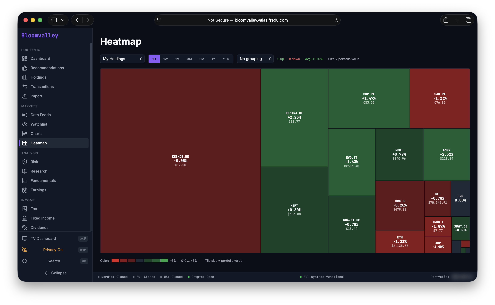
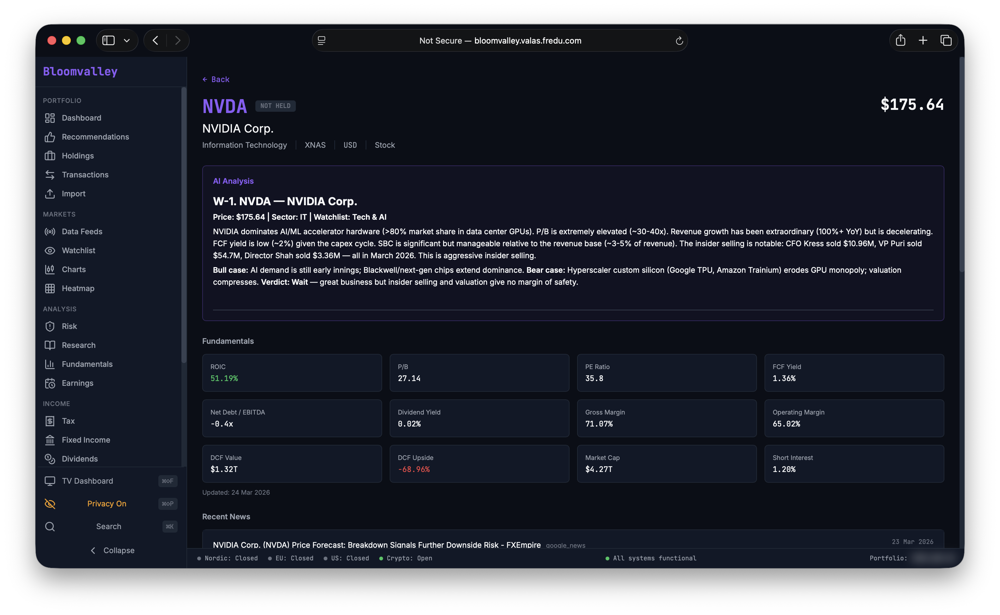
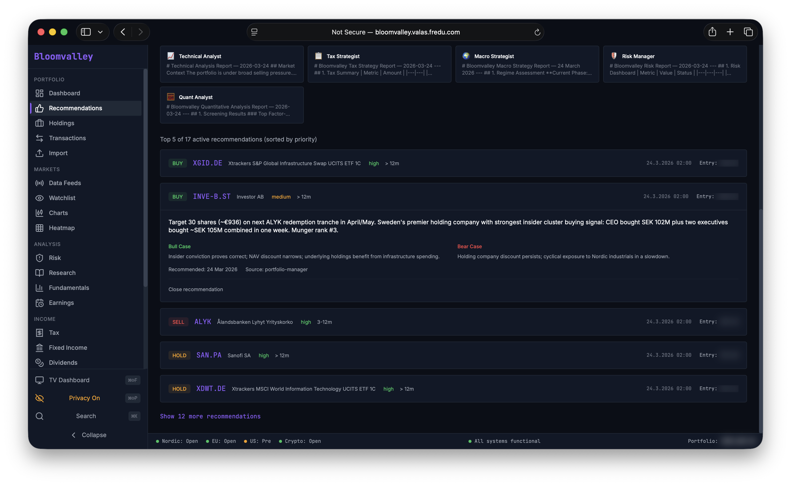
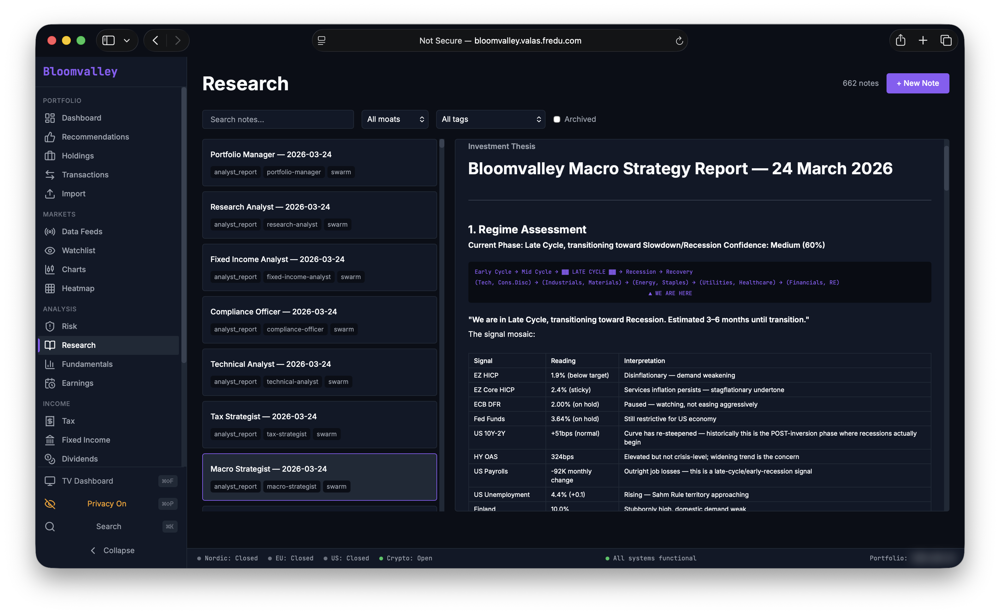
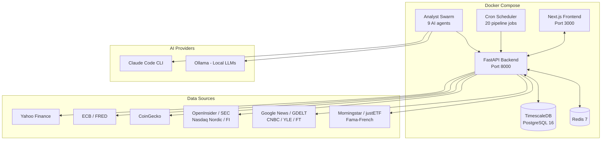

<p align="center">
  
</p>

<h1 align="center">Bloomvalley Terminal</h1>

<p align="center">
  <strong>A full-scale, production-grade investment analyst platform you deploy on your own server.</strong>
</p>

<p align="center">
  <a href="#quick-start"></a>
  
  
  
  
  
  
  <a href="LICENSE"></a>
</p>

---

A personal Bloomberg-style terminal for monitoring your investments, tracking world news and insider activity, and getting AI-powered analysis of your portfolio.

I started this project to explore three ideas:

1. **An unbiased personal financial analyst.** No bank selling you products, no subscription service with conflicts of interest — just a data platform that pulls from 20+ sources and an AI analyst swarm that evaluates your holdings and watchlists on metrics that matter to you: ROIC, free cash flow, P/B, margin of safety, and whatever else you configure.

2. **Spec-driven development, not vibe coding.** Every feature starts as a written specification. The entire system was built by AI agent teams with distinct roles — Product Owner, Architect, DBA, Frontend Developer, Backend Developer — each responsible for their domain. The result is a maintainable codebase with proper database schema, security boundaries, and the tech stack I actually wanted, not whatever the LLM felt like using.

3. **Fully local, zero external dependencies at runtime.** The entire platform deploys with `docker compose up` on your own server or localhost. The analyst swarm runs on **Ollama** (local LLMs) or Claude — your choice. No data leaves your machine unless you want it to.

The analyst swarm — 9 specialized agents from Portfolio Manager to Compliance Officer — runs multiple times per day, analyzing your current assets and watchlist securities for buy/sell/hold opportunities. And everything is tweakable: the agent definitions are plain Markdown files you can edit to match your own investment thesis.


*Portfolio heatmap — treemap of your current holdings weighted by position size, color-coded by performance.*

## The AI Analyst Team

An autonomous swarm of 9 specialized investment analysts runs 3x daily, each with deep domain expertise:

| Role | What it does |
|------|-------------|
| **Portfolio Manager** | Lead strategist — synthesizes all analyst inputs into buy/sell/hold recommendations with target prices |
| **Research Analyst** | Deep fundamental analysis with bull/bear/base cases, intrinsic value, moat ratings |
| **Risk Manager** | Portfolio risk metrics, stress testing, correlation analysis, diversification checks |
| **Quant Analyst** | Factor analysis (Fama-French), backtesting, Monte Carlo simulations, screening |
| **Macro Strategist** | Macro regime detection, asset allocation, global event impact analysis |
| **Fixed Income Analyst** | Bond analysis, yield curve positioning, credit risk, duration management |
| **Tax Strategist** | Finnish tax optimization, loss harvesting, tax-advantaged account strategy |
| **Technical Analyst** | Chart patterns, momentum signals, support/resistance, sentiment analysis |
| **Compliance Officer** | Regulatory checks, concentration limits, risk guardrails |

The swarm runs on **Claude Code CLI** or **Ollama** (local LLMs) — your choice. Agent definitions are fully customizable Markdown files in `.claude/agents/`.

## How It Was Built

This project uses **spec-driven development** — every feature starts as a written specification before any code is written. All specs, agent definitions, and architectural decisions live in the repository (`AGENTS.md`, `CLAUDE.md`, `.claude/agents/`).

The terminal itself was developed by an **AI development team** of 5 agents:

| Role | Responsibility |
|------|---------------|
| **Product Owner** | Feature specs, prioritization, acceptance criteria |
| **Architect** | System design, data models, API contracts |
| **DBA** | Schema design, migrations, query optimization, TimescaleDB hypertables |
| **Frontend Developer** | Next.js pages, components, TradingView charts, responsive design |
| **Backend Developer** | FastAPI endpoints, pipeline adapters, financial calculations |

## Screenshots

<!-- Replace these placeholders with actual screenshots -->

| | |
|:---:|:---:|
|  |  |
| **Security Detail** — single ticker with AI analyst overview, fundamentals, charts, insider activity | **AI Recommendations** — Portfolio Manager synthesizes input from Risk Manager, Tax Strategist, Macro Strategist, and 6 more analysts |
|  | |
| **Macro Strategist Report** — AI-generated macro regime analysis | |

## Features

### Portfolio & Trading
- **Portfolio Dashboard** — real-time holdings, P&L, portfolio value chart, allocation by asset class and account
- **AI Recommendations** — buy/sell/hold signals from the analyst swarm with bull/bear cases, confidence levels, target prices, and retrospective accuracy tracking
- **Holdings** — current positions across accounts with cost basis, unrealized P&L, live quotes, dividend income
- **Transactions** — filterable transaction log with type/account filters, search, pagination, and summary stats
- **Nordnet Import** — paste Nordnet portfolio exports (Finnish CSV), automatic security matching and reconciliation

### Market Data
- **20+ Data Pipelines** — automated fetching from Yahoo Finance, ECB, FRED, CoinGecko, Morningstar, SEC EDGAR, and more
- **Watchlists** — multiple watchlists tracking Nordic, European, and US markets
- **TradingView Charts** — candlestick/line charts with SMA, EMA, Bollinger, RSI, MACD
- **Heatmap** — treemap visualization with 1D/1W/1M/3M/6M/1Y/YTD periods

### Analysis
- **Risk Analysis** — Sharpe/Sortino ratios, max drawdown, VaR, beta, correlation heatmap, stress tests, glidepath tracking
- **Research Notes** — per-security notes with bull/bear/base cases, intrinsic value, margin of safety, moat ratings
- **Research Coverage** — dashboard showing which securities have stale or missing analyst coverage, with staleness badges and filters
- **Analyst Consensus** — view how the 9 AI agents agree or disagree per security, with conflict detection between Research Analyst and Portfolio Manager
- **Recommendation Accuracy** — mark-to-market tracking of PM recommendations at 30/90/180 day checkpoints with win rates, avg returns, and best/worst calls
- **Fundamentals** — P/B, FCF, DCF valuation, ROIC, margins, short interest
- **Earnings** — calendar with estimates, actual EPS, revenue surprises
- **Retirement Projections** — Monte Carlo simulation (10,000 paths) with fan chart, survival probabilities, safe withdrawal rate, and sensitivity analysis

### Income & Tax
- **Tax Analysis** — Finnish tax law (30/34%), tax lot tracking, deemed cost comparison, loss harvesting
- **Fixed Income** — bond holdings with coupon rates, YTM, credit ratings, duration
- **Dividends** — calendar, yield metrics, income projections, historical events

### Macro & News
- **Macro Dashboard** — Finland, Eurozone, and US indicators with yield curves
- **News Feed** — Google News RSS + CNBC, ECB, YLE, DI, FT, Yardeni
- **Global Events** — GDELT-powered macro event tracking with sector impact analysis

### Insider Tracking
- **Insider Trades** — FI/SE/US insider transactions with signal detection (cluster buying, CEO/CFO buys)
- **Congress Trades** — US Congress member stock trades (STOCK Act)
- **SEC Filings** — Form 4 & 13F-HR filings

### Special Features
- **Security Detail Pages** — deep-dive per ticker with fundamentals, charts, news, insider activity, analyst reports
- **TV Dashboard** — 2-page fullscreen mode with portfolio heatmap, recommendations, news, per-holding AI analysis tiles
- **Command Palette** (`Cmd+K`) — search across features and securities
- **Privacy Mode** (`Cmd+Shift+P`) — blur all monetary amounts
- **PWA** — installable on mobile, offline access to dashboard, recommendations, holdings
- **Status Bar** — live pipeline indicators, market hours for Nordic/EU/London/US/Crypto
- **Telegram Alerts** — PM recommendations, macro regime changes, insider cluster buying, insider/congress trades on held securities

## Architecture



## Tech Stack

| Layer | Technology |
|-------|-----------|
| Frontend | Next.js 14, TypeScript, TailwindCSS, TradingView Lightweight Charts, Recharts |
| Backend | Python 3.12, FastAPI, SQLAlchemy 2.0 (async), pandas, numpy |
| Database | PostgreSQL 16 + TimescaleDB |
| Cache | Redis 7 |
| AI Analysts | Claude Code CLI or Ollama (local LLMs), 9 agent definitions |
| Data Sources | Yahoo Finance, ECB, FRED, CoinGecko, Morningstar, SEC EDGAR, GDELT, + 10 more |
| Deployment | Docker Compose, self-hosted |

---

## Quick Start

### Docker (recommended)

```bash
git clone https://github.com/freducom/bloomvalley.git
cd bloomvalley
cp .env.example .env        # Add your FRED_API_KEY
cp analyst-swarm/config.yaml analyst-swarm/config.local.yaml

# Generate an API key for internal service authentication
echo "API_KEY=$(openssl rand -base64 32)" >> .env

docker compose up -d --build
docker compose exec backend alembic upgrade head
```

Open http://localhost:3000. Trigger initial data fetch (include the API key from `.env`):

```bash
API_KEY=$(grep API_KEY .env | cut -d= -f2-)
curl -H "X-API-Key: $API_KEY" -X POST http://localhost:8000/api/v1/pipelines/yahoo_daily_prices/run
curl -H "X-API-Key: $API_KEY" -X POST http://localhost:8000/api/v1/pipelines/ecb_fx_rates/run
curl -H "X-API-Key: $API_KEY" -X POST http://localhost:8000/api/v1/pipelines/fred_macro_indicators/run
curl -H "X-API-Key: $API_KEY" -X POST http://localhost:8000/api/v1/pipelines/coingecko_prices/run
```

### Services

| Service | Port | Description |
|---------|------|-------------|
| `frontend` | 3000 | Next.js PWA |
| `backend` | 8000 | FastAPI REST API |
| `db` | 5432 | TimescaleDB (PostgreSQL 16) |
| `redis` | 6379 | Redis 7 with AOF persistence |
| `cron` | — | 20 scheduled data pipeline jobs |
| `analyst-swarm` | — | 9 AI analyst agents (4 daily + 3 nighttime runs) |

### API Keys

| Key | Required | Free? | Source |
|-----|----------|-------|--------|
| `API_KEY` | Recommended | — | `openssl rand -base64 32` — protects `/api/*` routes |
| `FRED_API_KEY` | Yes | Yes | [fred.stlouisfed.org](https://fred.stlouisfed.org/docs/api/api_key.html) |
| `ALPHA_VANTAGE_API_KEY` | Optional | Yes (limited) | [alphavantage.co](https://www.alphavantage.co/support/#api-key) |
| `FINNHUB_API_KEY` | Optional | Yes (limited) | [finnhub.io](https://finnhub.io/) |

**No API key needed for:** Yahoo Finance, ECB, CoinGecko, Google News, OpenInsider, Nasdaq Nordic, Swedish FI, SEC EDGAR, Quiver Quantitative, Morningstar, justETF, Kenneth French, GDELT, regional RSS feeds.

---

## Data Pipelines

20 automated pipelines fetch data on schedule (all times Europe/Helsinki):

| Pipeline | Source | Schedule |
|----------|--------|----------|
| `yahoo_daily_prices` | Yahoo Finance | Weekdays 23:00 |
| `yahoo_dividends` | Yahoo Finance | Weekdays 23:30 |
| `yahoo_fundamentals` | Yahoo Finance | Weekdays 23:45 |
| `ecb_fx_rates` | ECB | Weekdays 17:00 |
| `ecb_macro_indicators` | ECB SDW | Weekdays 12:00 |
| `fred_macro_indicators` | FRED | Daily 15:00 |
| `coingecko_prices` | CoinGecko | Every 6 hours |
| `alpha_vantage_prices` | Alpha Vantage | Weekdays 00:00 |
| `google_news` | Google News RSS | Every 4 hours |
| `regional_news` | CNBC, ECB, YLE, DI, FT, Yardeni | Every 4 hours |
| `gdelt_events` | GDELT | Every 6 hours |
| `openinsider` | OpenInsider.com | Weekdays 22:00 |
| `nasdaq_nordic_insider` | Nasdaq | Weekdays 19:00 |
| `fi_se_insider` | Swedish FI | Weekdays 19:30 |
| `sec_edgar_filings` | SEC EDGAR | Weekdays 21:00 |
| `quiver_congress_trades` | Quiver Quantitative | Weekdays 20:00 |
| `morningstar_ratings` | Morningstar | Sundays 11:00 |
| `justetf_profiles` | justETF | Sundays 10:00 |
| `french_factors` | Kenneth French Library | Sundays 12:00 |
| `news_cleanup` | — | Daily 04:00 |

Trigger any pipeline manually:
```bash
curl -H "X-API-Key: $API_KEY" -X POST http://localhost:8000/api/v1/pipelines/{pipeline_name}/run
```

---

## Keyboard Shortcuts

| Shortcut | Action |
|----------|--------|
| `Cmd+K` | Command palette — search features & securities |
| `Cmd+Shift+F` | Fullscreen TV dashboard |
| `Cmd+Shift+P` | Toggle privacy mode |
| `Cmd+1` / `2` / `3` | Dashboard / Transactions / Import |

---

<details>
<summary><strong>Local Development (without Docker)</strong></summary>

### Prerequisites

- Python 3.12+
- Node.js 20+
- PostgreSQL 16 with TimescaleDB extension
- Redis 7

### Database setup

```bash
createdb bloomvalley
psql bloomvalley -c "CREATE EXTENSION IF NOT EXISTS timescaledb;"
psql bloomvalley -c "CREATE EXTENSION IF NOT EXISTS pg_trgm;"
```

### Backend

```bash
cd backend
cp ../.env .env
python -m venv .venv
source .venv/bin/activate
pip install -e .
alembic upgrade head
python -m app.db.seed
uvicorn app.main:app --host 0.0.0.0 --port 8000 --reload
```

### Frontend

```bash
cd frontend
npm install
npm run dev
```

Open http://localhost:3000.

</details>

<details>
<summary><strong>Reverse Proxy Setup (Traefik / nginx)</strong></summary>

### CORS Configuration

Set `FRONTEND_URL` in `.env` to match your domain:

```bash
FRONTEND_URL=http://bloomvalley.example.com
```

Set `NEXT_PUBLIC_API_URL` to empty in `docker-compose.yml` so browser API calls go to the same origin:

```yaml
environment:
  - NEXT_PUBLIC_API_URL=
```

### Traefik example

Route all traffic through the frontend — Next.js middleware injects the
`API_KEY` header before forwarding `/api/*` requests to the backend.
Do **not** route `/api` directly to the backend or the key won't be injected.

```yaml
http:
  routers:
    bloomvalley:
      rule: "Host(`bloomvalley.example.com`)"
      entryPoints: [web]
      service: bloomvalley-frontend
  services:
    bloomvalley-frontend:
      loadBalancer:
        servers:
          - url: "http://172.17.0.1:3000"
```

### nginx example

Route everything through the frontend — the Next.js middleware handles API key injection.

```nginx
server {
    listen 80;
    server_name bloomvalley.example.com;

    location / {
        proxy_pass http://localhost:3000;
        proxy_set_header Host $host;
        proxy_set_header X-Real-IP $remote_addr;
        proxy_set_header Upgrade $http_upgrade;
        proxy_set_header Connection "upgrade";
    }
}
```

</details>

<details>
<summary><strong>Backup & Migration</strong></summary>

### What to back up

| Path | Contents | Critical? |
|------|----------|-----------|
| `$POSTGRES_DATA_DIR` | All portfolio data, prices, fundamentals, recommendations | **Yes** |
| `.env` | API keys, DB passwords | **Yes** |
| `.claude/agents/` | AI analyst definitions | Yes (in git) |
| `analyst-swarm/config.local.yaml` | Swarm config | Yes |
| `~/.claude/` | Claude CLI auth tokens | If using claude_cli |

### Database backup

```bash
docker compose exec db pg_dump -U warren --disable-triggers warren | gzip > backup_$(date +%Y%m%d).sql.gz
```

### Database restore

> Do NOT use `--single-transaction` with TimescaleDB dumps.

```bash
docker compose stop backend cron analyst-swarm
docker compose exec db psql -U warren -d postgres -c "DROP DATABASE warren;"
docker compose exec db psql -U warren -d postgres -c "CREATE DATABASE warren OWNER warren;"
gunzip -c backup.sql.gz | docker compose exec -T db psql -U warren warren
docker compose up -d
```

### Migrate to a new server

```bash
# Old server
docker compose exec db pg_dump -U warren --disable-triggers warren | gzip > migration.sql.gz
tar czf config.tar.gz .env analyst-swarm/config.local.yaml .claude/agents/

# New server
git clone https://github.com/freducom/bloomvalley.git && cd bloomvalley
tar xzf config.tar.gz
docker compose up -d db redis && sleep 10
gunzip -c migration.sql.gz | docker compose exec -T db psql -U warren warren
docker compose up -d --build
```

</details>

<details>
<summary><strong>PWA / Mobile</strong></summary>

The app is installable as a Progressive Web App on mobile devices.

- **Offline support**: Dashboard, Recommendations, and Holdings pages work offline with cached data
- **Install prompt**: Shows on mobile after 60 seconds (iOS: Share > Add to Home Screen; Android: native install)
- **Service worker**: Network-first strategy — always tries fresh data, falls back to cache when offline

Note: iOS Safari does not support background fetch. Data is cached when you visit.

</details>

<details>
<summary><strong>Project Structure</strong></summary>

```
bloomvalley/
├── docker-compose.yml          # 6 services
├── CLAUDE.md                   # AI agent instructions & project conventions
├── AGENTS.md                   # Investment & dev team specs
├── .claude/agents/             # 9 AI analyst agent definitions (Markdown)
├── analyst-swarm/
│   ├── swarm.py                # Orchestrator — schedules, runs agents, extracts recommendations
│   └── config.yaml             # LLM provider, schedule, parallel settings
├── backend/
│   ├── app/
│   │   ├── api/v1/             # 30+ FastAPI route modules
│   │   ├── db/models/          # 20+ SQLAlchemy ORM models
│   │   ├── pipelines/          # 20 data source adapters (adapter pattern)
│   │   └── services/           # Optimizer, backtester, screener, Monte Carlo, etc.
│   ├── alembic/                # Database migrations
│   └── cron_scheduler.py       # 20 scheduled pipeline jobs
└── frontend/
    ├── public/                 # PWA manifest, service worker, icons
    └── src/
        ├── app/                # 25 Next.js pages
        ├── components/         # Sidebar, StatusBar, CommandPalette, MetricCard
        └── lib/                # API client, formatters, privacy context
```

</details>

<details>
<summary><strong>Macro Indicators Tracked</strong></summary>

### Finland
- HICP inflation (YoY), Unemployment rate, Real GDP

### Eurozone
- ECB key rates (Main Refinancing, Deposit Facility)
- Euro AAA sovereign yield curve (2Y, 5Y, 10Y, 30Y)
- HICP inflation (headline + core), Unemployment, GDP growth

### United States
- Fed Funds rate, Treasury yields (2Y, 5Y, 10Y, 30Y) + spreads
- CPI, Core CPI, PCE, Breakeven inflation
- GDP, Unemployment, Nonfarm Payrolls, Jobless Claims

### Global
- High Yield and Investment Grade credit spreads (OAS)

</details>

---

<p align="center">
  <sub>Built with spec-driven development by AI agent teams. All specifications in the repository.</sub>
</p>
