# Spec Dependency Graph

Visual map of how specification documents depend on each other. A spec can only be implemented after all its dependencies are complete.

## Mermaid Diagram

```mermaid
graph TD
    %% Phase 1 — Foundations
    CONV[00-meta/spec-conventions]
    ARCH[01-system/architecture]
    DS[05-ui/design-system]

    %% Phase 2 — Core Data Layer
    DM[01-system/data-model]
    TF[03-calculations/tax-finnish]
    TLT[03-calculations/tax-lot-tracking]
    API[01-system/api-overview]

    %% Phase 3 — Pipelines
    PF[02-data-pipelines/pipeline-framework]
    YF[02-data-pipelines/yahoo-finance]
    AV[02-data-pipelines/alpha-vantage]
    FRED[02-data-pipelines/fred]
    ECB[02-data-pipelines/ecb]
    CG[02-data-pipelines/coingecko]
    JE[02-data-pipelines/justetf]
    MS[02-data-pipelines/morningstar]
    GE[02-data-pipelines/global-events]

    %% Phase 3 — Calculations
    PM[03-calculations/portfolio-math]
    RM[03-calculations/risk-metrics]
    GP[03-calculations/glidepath]
    SF[03-calculations/screening-factors]
    MC[03-calculations/monte-carlo]

    %% Phase 4 — API & UI
    OA[01-system/openapi.yaml]
    LN[05-ui/layout-navigation]
    CC[05-ui/component-catalog]

    %% Phase 5 — Features
    F01[F01 Portfolio Dashboard]
    F02[F02 Market Data Feeds]
    F03[F03 Watchlist & Screener]
    F04[F04 Risk Dashboard]
    F05[F05 Tax Module]
    F06[F06 Research Workspace]
    F07[F07 Macro Dashboard]
    F08[F08 Technical Charts]
    F09[F09 Fixed Income Module]
    F10[F10 Alerts & Rebalancing]
    F11[F11 ESG Overlay]
    F12[F12 Transaction Log & Reporting]
    F13[F13 Dividend Calendar]
    F14[F14 News & Impact]
    F15[F15 Insider & Institutional]
    F16[F16 Recommendation Tracker]
    F17[F17 Nordnet Import]
    F18[F18 Global Events & Sector Impact]

    %% Phase 1 dependencies
    CONV --> ARCH
    CONV --> DS
    CONV --> DM
    CONV --> TF

    %% Phase 2 dependencies
    ARCH --> DM
    ARCH --> API
    ARCH --> PF
    DM --> TLT
    TF --> TLT
    DM --> API
    DM --> PM
    DM --> SF

    %% Phase 3 — Pipeline dependencies
    PF --> YF
    PF --> AV
    PF --> FRED
    PF --> ECB
    PF --> CG
    PF --> JE
    PF --> MS
    PF --> GE
    DM --> YF
    DM --> AV
    DM --> FRED
    DM --> ECB
    DM --> CG
    DM --> JE
    DM --> MS
    DM --> GE

    %% Phase 3 — Calculation dependencies
    TLT --> PM
    PM --> RM
    PM --> GP
    PM --> MC
    RM --> MC
    GP --> MC
    DM --> SF

    %% Phase 4 dependencies
    API --> OA
    PM --> OA
    RM --> OA
    TLT --> OA
    GP --> OA
    SF --> OA
    DS --> LN
    DS --> CC
    LN --> CC

    %% Phase 5 — Feature dependencies
    OA --> F01
    OA --> F02
    OA --> F03
    OA --> F04
    OA --> F05
    OA --> F06
    OA --> F07
    OA --> F08
    OA --> F09
    OA --> F10
    OA --> F11
    OA --> F12
    OA --> F13
    OA --> F14
    OA --> F15
    OA --> F16
    OA --> F17
    OA --> F18
    CC --> F01
    CC --> F02
    CC --> F03
    CC --> F04
    CC --> F05
    CC --> F06
    CC --> F07
    CC --> F08
    CC --> F09
    CC --> F10
    CC --> F11
    CC --> F12
    CC --> F13
    CC --> F14
    CC --> F15
    CC --> F16
    CC --> F17
    CC --> F18

    %% Feature-specific calculation dependencies
    PM --> F01
    GP --> F01
    RM --> F04
    TF --> F05
    TLT --> F05
    SF --> F03
    PM --> F09
    GP --> F10
    MC --> F10
    SF --> F06
    RM --> F10

    %% Feature-specific pipeline dependencies
    YF --> F01
    YF --> F02
    YF --> F03
    CG --> F02
    FRED --> F07
    ECB --> F07
    JE --> F03
    MS --> F03
    YF --> F11
    GE --> F18
    FRED --> F18

    %% Style
    classDef foundation fill:#1e3a5f,stroke:#3b82f6,color:#f9fafb
    classDef data fill:#166534,stroke:#22c55e,color:#f9fafb
    classDef pipeline fill:#78350f,stroke:#f59e0b,color:#f9fafb
    classDef calc fill:#581c87,stroke:#8b5cf6,color:#f9fafb
    classDef api fill:#7f1d1d,stroke:#ef4444,color:#f9fafb
    classDef feature fill:#374151,stroke:#9ca3af,color:#f9fafb

    class CONV,ARCH,DS foundation
    class DM,TF,TLT,API data
    class PF,YF,AV,FRED,ECB,CG,JE,MS,GE pipeline
    class PM,RM,GP,SF,MC calc
    class OA,LN,CC api
    class F01,F02,F03,F04,F05,F06,F07,F08,F09,F10,F11,F12,F13,F14,F15,F16,F17,F18 feature
```



## Dependency Table

| Spec | Depends On |
|------|-----------|
| **Phase 1 — Foundations** | |
| spec-conventions | — (root) |
| architecture | spec-conventions |
| design-system | spec-conventions |
| **Phase 2 — Core Data** | |
| data-model | spec-conventions, architecture |
| tax-finnish | spec-conventions |
| tax-lot-tracking | data-model, tax-finnish |
| api-overview | architecture, data-model |
| **Phase 3 — Pipelines** | |
| pipeline-framework | architecture, data-model |
| yahoo-finance | pipeline-framework, data-model |
| alpha-vantage | pipeline-framework, data-model |
| fred | pipeline-framework, data-model |
| ecb | pipeline-framework, data-model |
| coingecko | pipeline-framework, data-model |
| justetf | pipeline-framework, data-model |
| morningstar | pipeline-framework, data-model |
| global-events | pipeline-framework, data-model |
| **Phase 3 — Calculations** | |
| portfolio-math | data-model, tax-lot-tracking |
| risk-metrics | portfolio-math |
| glidepath | portfolio-math |
| screening-factors | data-model |
| monte-carlo | risk-metrics, glidepath |
| **Phase 4 — API & UI** | |
| openapi.yaml | api-overview, all calculations, all pipelines |
| layout-navigation | design-system |
| component-catalog | design-system, layout-navigation |
| **Phase 5 — Features** | |
| F01 Portfolio Dashboard | openapi, component-catalog, portfolio-math, glidepath, yahoo-finance |
| F02 Market Data Feeds | openapi, component-catalog, yahoo-finance, coingecko |
| F03 Watchlist & Screener | openapi, component-catalog, screening-factors, justetf, morningstar |
| F04 Risk Dashboard | openapi, component-catalog, risk-metrics |
| F05 Tax Module | openapi, component-catalog, tax-finnish, tax-lot-tracking |
| F06 Research Workspace | openapi, component-catalog, screening-factors |
| F07 Macro Dashboard | openapi, component-catalog, fred, ecb |
| F08 Technical Charts | openapi, component-catalog, yahoo-finance, alpha-vantage |
| F09 Fixed Income Module | openapi, component-catalog, portfolio-math |
| F10 Alerts & Rebalancing | openapi, component-catalog, glidepath, risk-metrics, monte-carlo |
| F11 ESG Overlay | openapi, component-catalog, yahoo-finance |
| F12 Transaction Log & Reporting | openapi, component-catalog, portfolio-math, tax-finnish, tax-lot-tracking |
| F13 Dividend Calendar | openapi, component-catalog, yahoo-finance |
| F14 News & Impact | openapi, component-catalog |
| F15 Insider & Institutional | openapi, component-catalog |
| F16 Recommendation Tracker | openapi, component-catalog |
| F17 Nordnet Import | openapi, component-catalog, data-model |
| F18 Global Events & Sector Impact | openapi, component-catalog, global-events, fred |

## Build Order Summary

```
Level 0: spec-conventions
Level 1: architecture, design-system, tax-finnish
Level 2: data-model, api-overview, layout-navigation
Level 3: tax-lot-tracking, pipeline-framework, screening-factors, component-catalog
Level 4: all pipelines (yahoo, alpha-vantage, fred, ecb, coingecko, justetf, morningstar, global-events)
Level 4: portfolio-math
Level 5: risk-metrics, glidepath
Level 6: monte-carlo, openapi.yaml
Level 7: all features (F01-F18)
```

## Changelog

| Date | Change |
|------|--------|
| 2026-03-19 | Initial draft |
